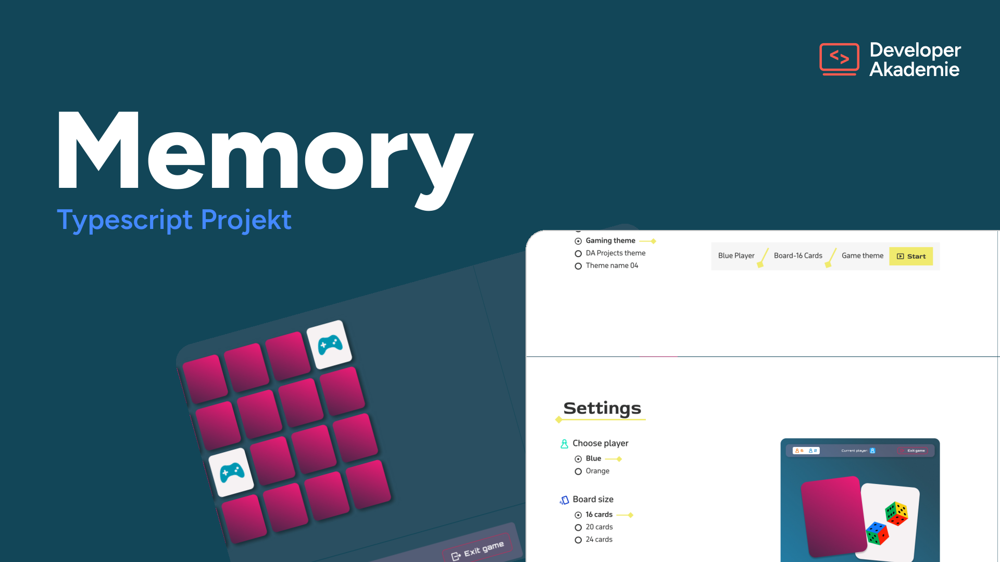

# Memory

A two-player Memory card game built as a Developer Akademie learning project.
Flip cards, find the pairs, and the player with the most matches wins.

<!-- TODO: replace with the real demo URL -->
[](https://memory.mischasiegrist.ch)



## Features

- **Two players** taking turns, with live score and turn indicator
- **Four themes** — Code vibes, Gaming, DA Projects and Foods — each with its own
  cards, colors, fonts and end screens
- **Three board sizes** — 16, 24 or 36 cards
- Themed exit and imprint dialogs, game-over and result screens

## Tech stack

- [Vite](https://vite.dev/) as dev server and bundler
- TypeScript (vanilla, no framework)
- SCSS

## Getting started

```bash
npm install      # install dependencies
npm run dev      # start the dev server
npm run build    # type-check and build to dist/
npm run preview  # serve the production build locally
```

## Deployment

The build uses a relative base (`base: './'` in `vite.config.ts`) and all asset
paths resolve relative to the app folder, so the contents of `dist/` can be
dropped into any directory on a server and will run from there.

## Author

Mischa Siegrist — © 2026
